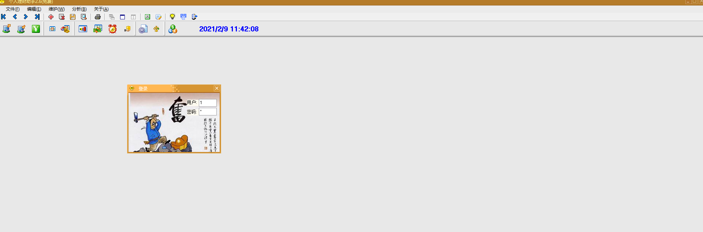
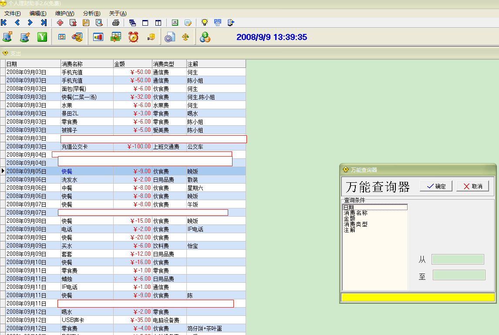
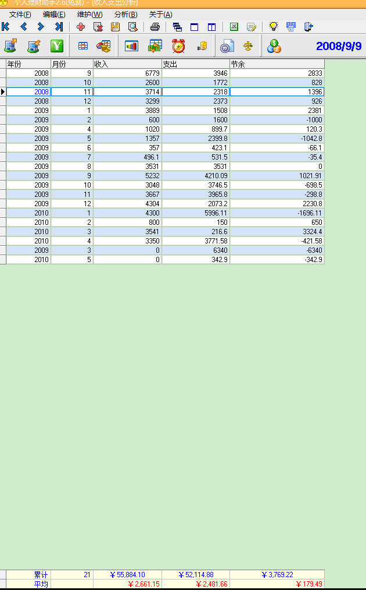
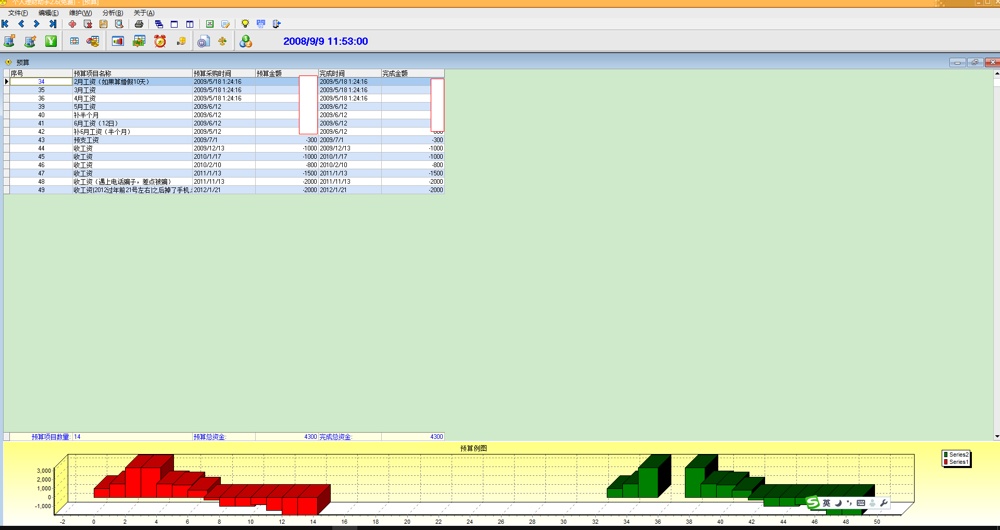
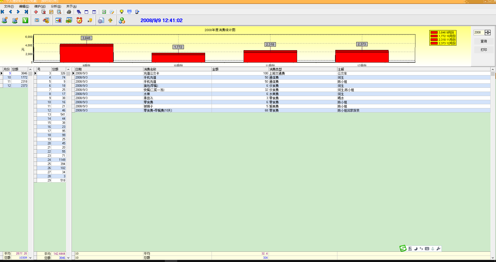
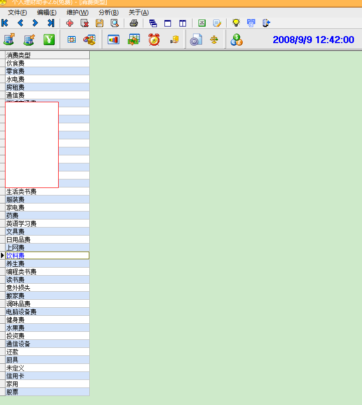
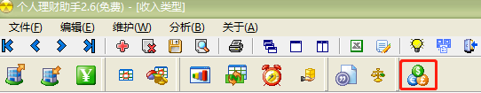

# Personal financial assistant

#### Introduction
This is a small software for practicing handwriting in 2008~2009. . . .

Personal financial assistant can complete income and expenditure accounting, budgeting, statistical analysis, account management and other functions to help you better manage your personal finances!

Simple operation: Let you know everything at a glance! The report analysis function allows you to have a clear view of your annual, monthly and daily financial status!

Easier and more powerful entry function than Excel 2003, allowing you to enter every income and expenditure as usual, making financial management a joy! For example, "My salary income is ￥3,000.00", "Stock investment is ￥10,000.00", and "I bought food for 20.2 yuan."

The budget function allows you to spend money in a planned way and control your wallet more!

Check consumption type:
    Query records with empty "consumption type", the query is inconsistent, which means: the consumption type is used and deleted.

Consumer name analysis:
    Such as "dining out", you can see the cost of a meal.
    Such as "Supper", you can see the cost of a meal.

    Such as "mobile phone recharge", you can see the expenditure of a communication fee.
    Such as "IP phone", you can see the expenditure of a communication fee.

Consumption type analysis:
    Such as "communication fee", you can see the expenditure of a communication fee.
    Such as "food expenses", you can see the expenses of a food expense.
Analysis by time:
   Can check out monthly, daily, and daily details. Expenses are clear at a glance. You can do it anytime, anywhere, and know it!

System environment requirements: Windows98, Windows NT 4.0, Windows2000, Windows XP or above.

#### Instructions for use

1. The default username: 1 password: 1, then press Enter

2. Easy entry: After logging in, press Ctrl+A, then press the Insert key, then press the F2 key twice, and finally press the Enter key to confirm the jump, and F1 to save.

   

#### Functions and shortcut keys:

| Quick key | Description | Quick key | Description |
| ------------- | ------------------- | ------------ | - ------------ |
| ctrl+Up and down scroll wheel | Zoom in and out the table | F2 | Pop-up drop-down list |
| **Esc** | **Close sub-window** | **F7** | **Universal Finder** |
| Ctrl+A | Expense Entry Window | Ctrl+S | Income Entry Window |
| Ctrl+D | Income and expenditure analysis | Ctrl+W | Consumption type entry |
| **F11** | **First Item** | **F12** | **Last Item** |
| **Insert** | **Add** | **Alt+Del** | **Delete** |
| **F1** | **Save** | F4 | Print |
| ctrl+alt+'+' | Enlarge table | ctrl+alt+'-' | Reduce table |
| | Export word, exelc, text | | |

   Without using a skin, you can put the PersonInOut.ini file in the directory
   SkindDataAction=1 changed to SkindDataAction=0;

Contains: Installation package production script: payoutV2.5.iss of InnoSetup

#### Function interface:

##### log in

##### Expense entry window

##### Income Entry Window

##### Income and expenditure analysis

##### All expenditure query

##### Budget

##### Consumer name analysis

#### Consumption type analysis

##### Analysis by time

#### List of consumption types

##### Income Type List

##### Change skin

##### Universal Finder (to open a sub-window such as "Expenditure Window", and then press "Query Finder" on the toolbar to be effective)

##### Print (to open a sub-window such as "Expense Window", and then press "Print" on the toolbar to be effective)

#### V2.5 update 20090331 fixes:
  1. Table record column width. Table size, (the fourth button from the bottom in the toolbar, can be restored)
  2. Print all expenditures and modify the print header
  3. 24-hour online banking link (automatically submit registration information)
  5. Color of income amount: "blue"
    6.Delete 1~N lines, the first line.
  7. Consumption type expenditure, expenditure correlation
  8. Add: Personalized menu (only effective when there is no skin)
  9. Total revenue added\total records

========================

#### Performance:

Use VckSkins (use skin):
Memory usage 12.536MB
Virtual memory 07.256MB
Number of handles 121
Number of threads 7
GDI objects 177
User object 75

No Use VclSkins (Do not use skin)
Memory usage 12.056MB
Virtual memory 06.156MB
Number of handles 120
Number of threads 7
GDI objects 132
User object 58

========================

#### Development:

Editor: delphi7, BDS2007

##### Rely on third-party components

VCLSkin, AutoUpgrader, ShareRegist