# 个人理财助手

#### 介绍
这是2008~2009练手写的小软件。。。。

个人理财助手可以完成收支记帐、预算、统计分析、帐户管理等功能，帮助你更好的管理个人财务！

简易的操作:让你对这一切一目了然！报表分析功能更能让你对每年,每月每日的财务状况清清楚楚！

比Excel 2003更易,更强大的录入功能，让你像平时说话一样录入每一项收支，让财务管理成为一种快乐！比如“我工资收入￥3,000.00元”、“股票投资￥10,000.00”“买了20.2元的食品”。

预算功能，让你花钱变得有计划，更能控制你的钱包！

检查消费类型:
    查询“消费类型”为空的记录，查询不一致，意思是：使用了,被删除了的消费类型.

消费名称分析:
    如"外吃饭",可以看出一个伙食费的开支.
    如"宵夜",  可以看出一个伙食费的开支.

    如"手机充值",可以看出一个通信费的开支.     
    如"IP电话",可以看出一个通信费的开支.     

消费类型分析:
    如"通信费",可以看出一个通信费的开支.
    如"伙食费",可以看出一个伙食费的开支.     
按时间分析:
   能查询出,每月,每日,每日明细.开支一目了然.随时随地,都能做到,心中有数!

系统环境要求：Windows98、Windows NT 4.0、Windows2000、Windows XP或以上版本。

#### 使用说明

1. 默认用户名:1  密码:1，然后回车

2. 简易录入:登录后,按Ctrl+A,接着按Insert键,再按2次F2键,最后按回车键确认跳转,F1保存.

   

#### 功能及快捷键:

| 快键键        | 说明                | 快键键       | 说明           |
| ------------- | ------------------- | ------------ | -------------- |
| ctrl+上下滚轮 | 放大缩小表格        | F2           | 弹出下拉列表   |
| **Esc**       | **关闭子窗**        | **F7**       | **万能查询器** |
| Ctrl+A        | 支出录入窗          | Ctrl+S       | 收入录入窗     |
| Ctrl+D        | 收入支出分析        | Ctrl+W       | 消费类型录入   |
| **F11**       | **第一条**          | **F12**      | **最后一条**   |
| **Insert**    | **增加**            | **Alt+Del**  | **删除**       |
| **F1**        | **存盘**            | F4           | 打印           |
| ctrl+alt+'+'  | 放大表格            | ctrl+alt+'-' | 缩小表格       |
|               | 导出word,exelc,text |              |                |

   不使用皮肤,可以把目录PersonInOut.ini文件中的
   SkindDataAction=1改为SkindDataAction=0; 

包含 ：安装包制作脚本：InnoSetup 的payoutV2.5.iss

#### 功能界面：

##### 登录

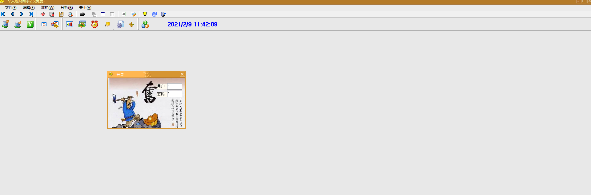

##### 支出录入窗口

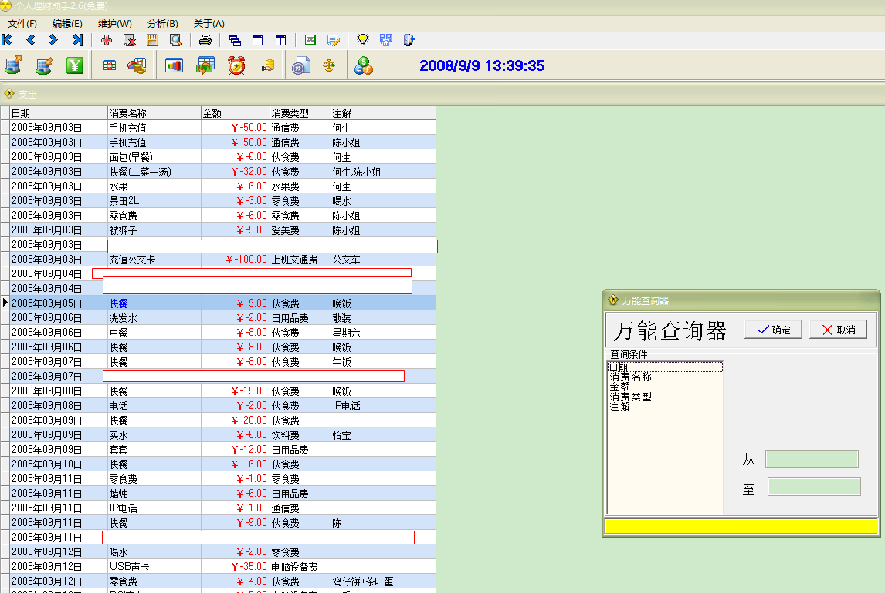

##### 收入录入窗口

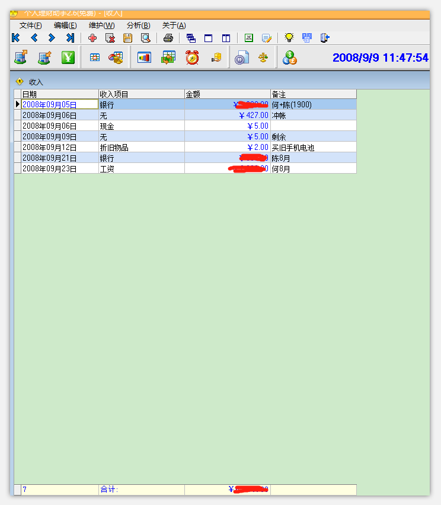

##### 收入支出分析

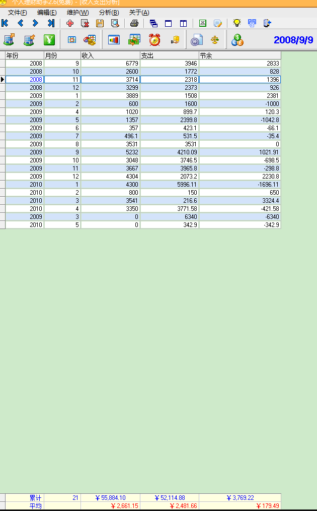

##### 全部支出查询

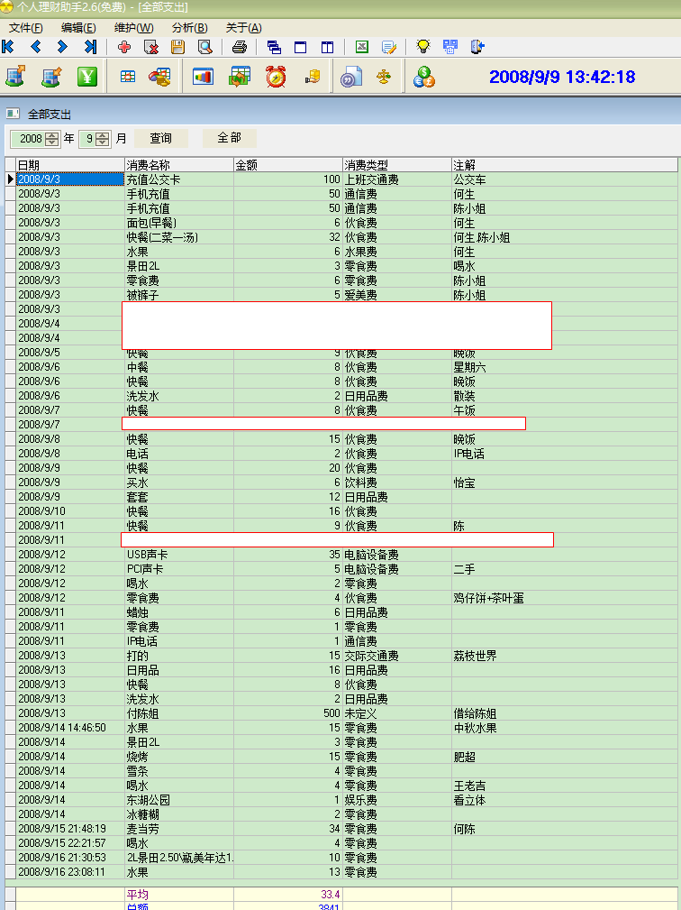

##### 预算

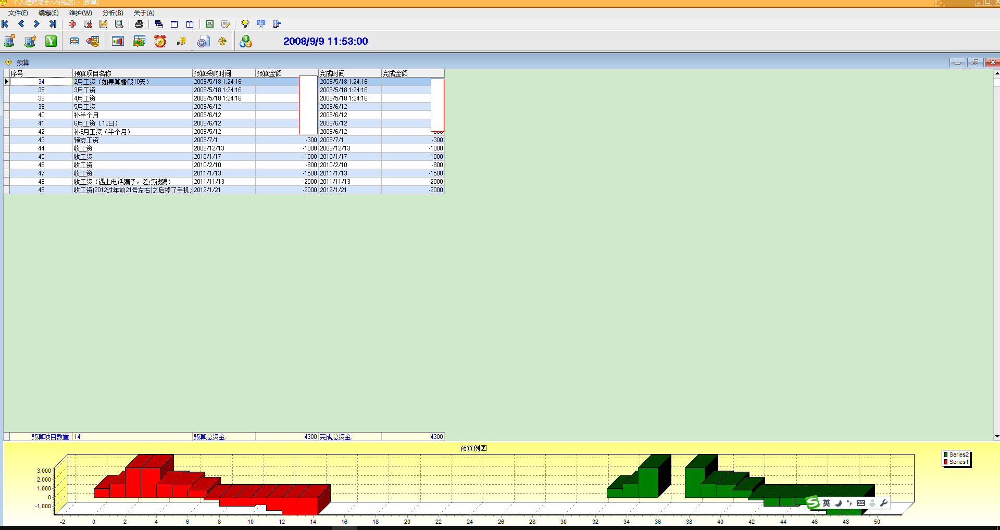

##### 消费名称分析

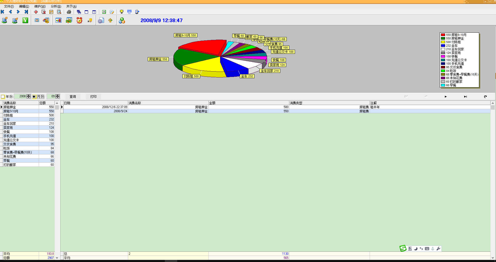

#### 消费类型分析

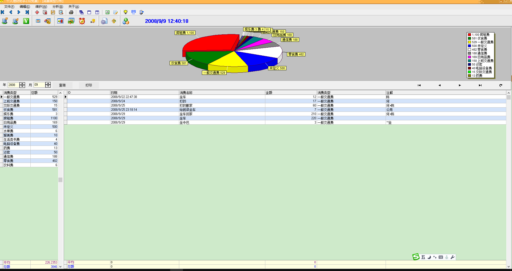

##### 按时间分析

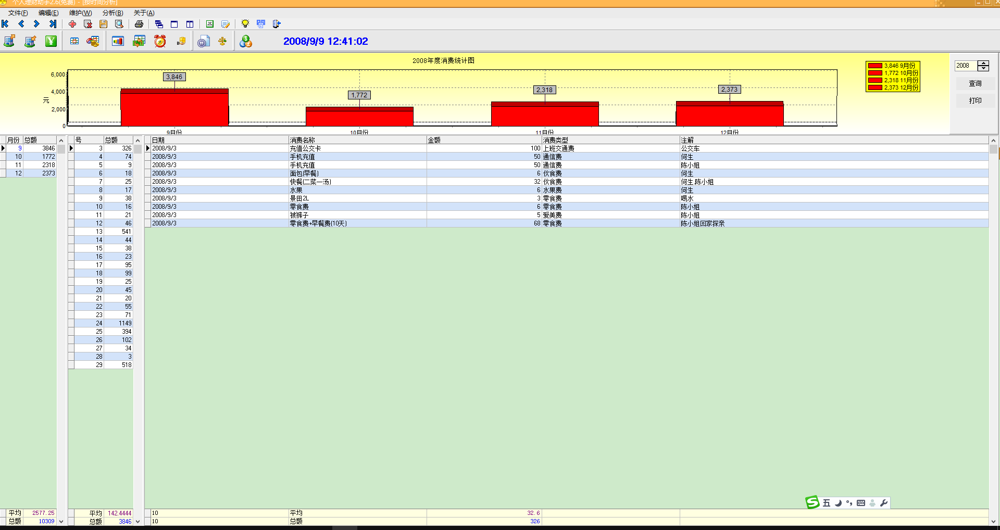

#### 消费类型列表

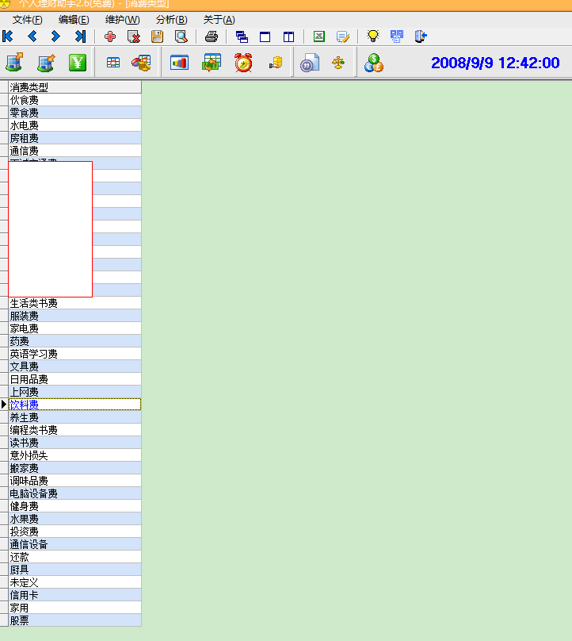

##### 收入类型列表

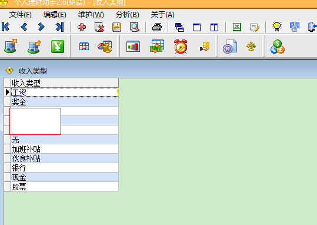

##### 换肤

##### 万能查询器（要打开子窗口如“支出窗口”，再按工具栏上的“查询器”，才有效）

##### 打印（要打开子窗口如“支出窗口”，再按工具栏上的“打印”，才有效）

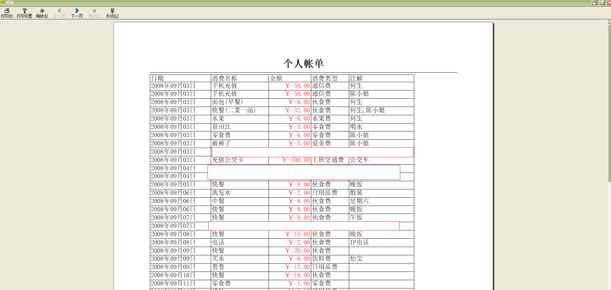

#### V2.5更新20090331修复:
  1、表格记录列宽.表格大小,(工具栏倒数第4个按钮,可恢复)
  2、全部支出打印,打印表头修正
  3、24小时在线网银链接(自动提交注册信息)
  5、收入的金额颜色:"蓝色"
  6.删除1~N行,首行.
  7.消费类型开支,支出关联
  8.添加:个性菜单（在没有皮肤的情况下才有效）
  9.收入添加合计\总记录数

=========================

#### 性能：

Use VckSkins（使用皮肤）：
内存使用  12.536MB
虚拟内存  07.256MB
句柄数    121
线程数    7
GDI对象   177
User对象  75 

No Use VclSkins（不使用皮肤）
内存使用  12.056MB
虚拟内存  06.156MB
句柄数    120
线程数    7
GDI对象   132
User对象  58 

=========================

#### 开发：

编辑器：delphi7、BDS2007

##### 依赖第三方组件

VCLSkin、AutoUpgrader、ShareRegist